# **Prediction of Lung Cancer Risk Using Patient Data**
Fall 2024 Data Science Project <br/>
*Mia Cohen, Rena Max, Ilana Borison, Sam Rosemore, Taylor Lowenthal, Talia David*

### **Contributions:**


|Name |    Itemized Contribution List* | Summary|
|-------------------|------------------|------------------|
|Talyor   | - Checkpoint 1: Concept brainstorming<br>- Checkpoint 2: Concept/test choices<br>- Checkpoint 3: ML Model Choice<br>- Checkpoint 3: Insights/Conclusions Writing | Taylor played a very important role in  moderating and directing our choices and discussions regarding datasets,<br>test choices, and model choices. He contributed his educated opinion in conversation to many aspects of the project,<br> and authored the Insights and Conclusions section for Checkpoint 3.|
|Ilana|- Checkpoint 1: Concept brainstorming<br>- Checkpoint 1: Answer text<br>- Checkpoint 2: Data Cleaning<br>- Checkpoint 2: Spearman’s Rank-Order Tests<br>- Checkpoint 2: Spearman’s Rank-Order Viz<br>- Checkpoint 2: Spearman’s Rank-Order Writing<br>- Checkpoint 3: Intro writing<br>- Checkpoint 3: Exploratory Data Analysis/Writing<br>- Checkpoint 3: ML Model Choice<br>- Checkpoints 1-3: Initial Colab files creation+formatting| Ilana has been a crucial member of this team and made active contributions to every section of this project. She has been a voice in all of our decision-making<br>conversations and has contributed code and/or writing to each Checkpoint submitted, including the entire Spearman’s Rank section and much of the Data-Cleaning<br>in Checkpoint 2, the Intro and Exploratory Data Analysis sections in Checkpoint 3, and parts of the answer text in Checkpoint 1.|
|Mia |- Checkpoint 1: Concept brainstorming<br>- Checkpoint 2: Data mounting<br>- Checkpoint 2: Chi-Squared Test Code<br>- Checkpoint 2: Chi-Squared Viz code<br>- Checkpoint 2: Chi-Squared Section Writing<br>- Checkpoints 1-3: Ensuring proper <br>Gradescope Submission<br>- Checkpoint 3: Previous work breakdown<br>- Checkpoint 3: ML code (assist)<br>- Checkpoint 3: Text editing and GitHub handling| Mia has been a productive member of this team, offering a practical voice in work discussions and an eagerness to contribute. She wrote the Chi-Squared<br>section in Checkpoint 2, handled other coding tasks across Checkpoints 2 and 3 (including the data mounting and parts of the ML sections), ensured that all<br>members were properly credited on Gradescope, and handled the task breakdown for Checkpoint 3.|
|Rena|- Checkpoint 1: Concept brainstorming<br>- Checkpoint 1: Answer text<br>- Checkpoint 2: ANOVA Test Code<br>- Checkpoint 2: ANOVA Post-hoc Tests Code<br>- Checkpoint 2: ANOVA Visualizations Code<br>- Checkpoint 2: ANOVA Section Writing<br>- Checkpoint 3: Data Curation Writing| Rena has been an indispensable voice of reason throughout our brainstorming sessions and decision-making processes. She has also contributed to the answer writing<br>for Checkpoint 1, the entire ANOVA section in Checkpoint 2, and the Data Curation section in Checkpoint 3.|
|Talia|- Checkpoint 1: Concept brainstorming<br>- Checkpoint 1: Finding dataset(s)<br>- Checkpoint 2: Data preprocessing<br>- Checkpoint 3: ML Model Choice<br>- Checkpoint 3: Data Viz Code<br>- Checkpoint 3: Data Viz writing| Talia played a key role in shaping our initial concept and dataset selection, as well as in deciding on our final model. She wrote the data<br>preprocessing code for Checkpoint 2 and handled both the code and writing for the data visualization section in Checkpoint 3.|
|Sam|- Checkpoint 1: Concept brainstorming<br>- Checkpoint 1: Finding dataset(s)<br>- Checkpoint 1: Answer text<br>- Checkpoint 2: Concept/test choice<br>- Checkpoint 3: ML Model Choice<br>- Checkpoint 3: ML code (lead)<br>- Checkpoint 3: ML writing| Sam was a driving force in this project, actively contributing to discussions on the concept, dataset, and choices for ML models and tests.<br>In Checkpoint 1, he participated in the answer writing, and in Checkpoint 3, he handled the majority of the ML code and writing.|


**Please note that not all listed contributions are equal to each other or as simple or difficult as the wording may make them seem*

###**Introduction**  <br/>

Lung cancer is one of the leading causes of cancer-related deaths worldwide, and understanding its risk factors and progression is critical for early detection and prevention. This analysis seeks to leverage a dataset containing various environmental, lifestyle, and biological features to answer two key questions:

1. *What is the probability that a patient will develop lung cancer, based on the features in the dataset?*
2. *What risk factors contribute the most to the development of lung cancer?*  <br/>

Answering these questions can help identify high-risk individuals and direct research toward mitigating contributing factors. By using data science techniques, particularly Random Forest models, we aim to derive actionable insights that can improve healthcare outcomes.

We chose this dataset from Kaggle, titled [Lung Cancer Patients](https://www.kaggle.com/datasets/thedevastator/cancer-patients-and-air-pollution-a-new-link)
 because it provides a structured format conducive to machine learning and data analysis. The dataset includes features related to environmental exposure (e.g. air pollution, occupational hazards), lifestyle choices (e.g. smoking, alcohol use), and genetic risk factors. These diverse features provide a good foundation for predictive modeling and identifying key contributors to lung cancer development.

As a group, we seek to explore healthcare applications of data science and understanding a disease in which we may not have prior expertise. This dataset presents an exciting opportunity to analyze and visualize meaningful patterns, expand our knowledge in healthcare, and hone our machine learning skills.

### **Data Curation** <br/>

**Data source:** Kaggle Lung Cancer Dataset
https://www.kaggle.com/datasets/thedevastator/cancer-patients-and-air-pollution-a-new-link

**Additional resources**

Similar datasets for further research on the topic of lung cancer prediction based on risk factors:

https://www.kaggle.com/datasets/rashadrmammadov/lung-cancer-prediction

https://www.kaggle.com/datasets/wajahat1064/lung-cancer-survey-data

Resources for understanding the statistical tests and techniques in this analysis:

Chi-Squared Test: https://www.jmp.com/en_us/statistics-knowledge-portal/chi-square-test/chi-square-test-of-independence.html#:~:text=What%20is%20the%20Chi%2Dsquare,to%20be%20related%20or%20not.

Spearman's Rank-Order Correlation: https://statistics.laerd.com/statistical-guides/spearmans-rank-order-correlation-statistical-guide.php

ANOVA: https://www.qualtrics.com/experience-management/research/anova/#:~:text=ANOVA%2C%20or%20Analysis%20of%20Variance,more%20unrelated%20samples%20or%20groups.

Random Forest Classification: https://www.ibm.com/topics/random-forest

Decision Tree Classification: https://www.geeksforgeeks.org/decision-tree/


### **Exploratory Data Analysis** <br/>


```python
import pandas as pd
import matplotlib as mp
from matplotlib import pyplot as plt
import numpy as np
import seaborn as sns


from google.colab import drive
drive.mount("/content/drive/", force_remount=True)
```

    Mounted at /content/drive/
    

**Data Preprocessing**


```python
# Import/Set Up (this path ONLY works by having a shortcut to '320FinalProject' in the drive)
df = pd.read_csv('/content/drive/MyDrive/320FinalProject/Kaggle Data Sets/cancer patient data sets.csv')
# df = pd.read_csv('cancer patient data sets.csv') #this is the code if you want to import direct

# Parse/Clean: Removing patient ID since it is not relevant for our analysis
df.drop(['Patient Id'], axis=1, inplace=True)
# assigning "male" to gender 1 and "female" to gender 2
df['Gender'] = df['Gender'].replace({1: 'male', 2: 'female'})

# remove index since dataframes already have built in index
df.drop(['index'], axis=1, inplace=True)
# fix the capitalization of the column names for better readability and clarity
df.rename(columns={"Alcohol use": "Alcohol Use", "OccuPational Hazards": "Occupational Hazards", "chronic Lung Disease": "Chronic Lung Disease"}, inplace=True)

# Show DataFrame
df
```


  <div id="df-8ed8b50c-1554-49e3-9ec1-2056c879fc9c" class="colab-df-container">
    <div>
<style scoped>
    .dataframe tbody tr th:only-of-type {
        vertical-align: middle;
    }

    .dataframe tbody tr th {
        vertical-align: top;
    }

    .dataframe thead th {
        text-align: right;
    }
</style>
<table border="1" class="dataframe">
  <thead>
    <tr style="text-align: right;">
      <th></th>
      <th>Age</th>
      <th>Gender</th>
      <th>Air Pollution</th>
      <th>Alcohol Use</th>
      <th>Dust Allergy</th>
      <th>Occupational Hazards</th>
      <th>Genetic Risk</th>
      <th>Chronic Lung Disease</th>
      <th>Balanced Diet</th>
      <th>Obesity</th>
      <th>...</th>
      <th>Fatigue</th>
      <th>Weight Loss</th>
      <th>Shortness of Breath</th>
      <th>Wheezing</th>
      <th>Swallowing Difficulty</th>
      <th>Clubbing of Finger Nails</th>
      <th>Frequent Cold</th>
      <th>Dry Cough</th>
      <th>Snoring</th>
      <th>Level</th>
    </tr>
  </thead>
  <tbody>
    <tr>
      <th>0</th>
      <td>33</td>
      <td>male</td>
      <td>2</td>
      <td>4</td>
      <td>5</td>
      <td>4</td>
      <td>3</td>
      <td>2</td>
      <td>2</td>
      <td>4</td>
      <td>...</td>
      <td>3</td>
      <td>4</td>
      <td>2</td>
      <td>2</td>
      <td>3</td>
      <td>1</td>
      <td>2</td>
      <td>3</td>
      <td>4</td>
      <td>Low</td>
    </tr>
    <tr>
      <th>1</th>
      <td>17</td>
      <td>male</td>
      <td>3</td>
      <td>1</td>
      <td>5</td>
      <td>3</td>
      <td>4</td>
      <td>2</td>
      <td>2</td>
      <td>2</td>
      <td>...</td>
      <td>1</td>
      <td>3</td>
      <td>7</td>
      <td>8</td>
      <td>6</td>
      <td>2</td>
      <td>1</td>
      <td>7</td>
      <td>2</td>
      <td>Medium</td>
    </tr>
    <tr>
      <th>2</th>
      <td>35</td>
      <td>male</td>
      <td>4</td>
      <td>5</td>
      <td>6</td>
      <td>5</td>
      <td>5</td>
      <td>4</td>
      <td>6</td>
      <td>7</td>
      <td>...</td>
      <td>8</td>
      <td>7</td>
      <td>9</td>
      <td>2</td>
      <td>1</td>
      <td>4</td>
      <td>6</td>
      <td>7</td>
      <td>2</td>
      <td>High</td>
    </tr>
    <tr>
      <th>3</th>
      <td>37</td>
      <td>male</td>
      <td>7</td>
      <td>7</td>
      <td>7</td>
      <td>7</td>
      <td>6</td>
      <td>7</td>
      <td>7</td>
      <td>7</td>
      <td>...</td>
      <td>4</td>
      <td>2</td>
      <td>3</td>
      <td>1</td>
      <td>4</td>
      <td>5</td>
      <td>6</td>
      <td>7</td>
      <td>5</td>
      <td>High</td>
    </tr>
    <tr>
      <th>4</th>
      <td>46</td>
      <td>male</td>
      <td>6</td>
      <td>8</td>
      <td>7</td>
      <td>7</td>
      <td>7</td>
      <td>6</td>
      <td>7</td>
      <td>7</td>
      <td>...</td>
      <td>3</td>
      <td>2</td>
      <td>4</td>
      <td>1</td>
      <td>4</td>
      <td>2</td>
      <td>4</td>
      <td>2</td>
      <td>3</td>
      <td>High</td>
    </tr>
    <tr>
      <th>...</th>
      <td>...</td>
      <td>...</td>
      <td>...</td>
      <td>...</td>
      <td>...</td>
      <td>...</td>
      <td>...</td>
      <td>...</td>
      <td>...</td>
      <td>...</td>
      <td>...</td>
      <td>...</td>
      <td>...</td>
      <td>...</td>
      <td>...</td>
      <td>...</td>
      <td>...</td>
      <td>...</td>
      <td>...</td>
      <td>...</td>
      <td>...</td>
    </tr>
    <tr>
      <th>995</th>
      <td>44</td>
      <td>male</td>
      <td>6</td>
      <td>7</td>
      <td>7</td>
      <td>7</td>
      <td>7</td>
      <td>6</td>
      <td>7</td>
      <td>7</td>
      <td>...</td>
      <td>5</td>
      <td>3</td>
      <td>2</td>
      <td>7</td>
      <td>8</td>
      <td>2</td>
      <td>4</td>
      <td>5</td>
      <td>3</td>
      <td>High</td>
    </tr>
    <tr>
      <th>996</th>
      <td>37</td>
      <td>female</td>
      <td>6</td>
      <td>8</td>
      <td>7</td>
      <td>7</td>
      <td>7</td>
      <td>6</td>
      <td>7</td>
      <td>7</td>
      <td>...</td>
      <td>9</td>
      <td>6</td>
      <td>5</td>
      <td>7</td>
      <td>2</td>
      <td>4</td>
      <td>3</td>
      <td>1</td>
      <td>4</td>
      <td>High</td>
    </tr>
    <tr>
      <th>997</th>
      <td>25</td>
      <td>female</td>
      <td>4</td>
      <td>5</td>
      <td>6</td>
      <td>5</td>
      <td>5</td>
      <td>4</td>
      <td>6</td>
      <td>7</td>
      <td>...</td>
      <td>8</td>
      <td>7</td>
      <td>9</td>
      <td>2</td>
      <td>1</td>
      <td>4</td>
      <td>6</td>
      <td>7</td>
      <td>2</td>
      <td>High</td>
    </tr>
    <tr>
      <th>998</th>
      <td>18</td>
      <td>female</td>
      <td>6</td>
      <td>8</td>
      <td>7</td>
      <td>7</td>
      <td>7</td>
      <td>6</td>
      <td>7</td>
      <td>7</td>
      <td>...</td>
      <td>3</td>
      <td>2</td>
      <td>4</td>
      <td>1</td>
      <td>4</td>
      <td>2</td>
      <td>4</td>
      <td>2</td>
      <td>3</td>
      <td>High</td>
    </tr>
    <tr>
      <th>999</th>
      <td>47</td>
      <td>male</td>
      <td>6</td>
      <td>5</td>
      <td>6</td>
      <td>5</td>
      <td>5</td>
      <td>4</td>
      <td>6</td>
      <td>7</td>
      <td>...</td>
      <td>8</td>
      <td>7</td>
      <td>9</td>
      <td>2</td>
      <td>1</td>
      <td>4</td>
      <td>6</td>
      <td>7</td>
      <td>2</td>
      <td>High</td>
    </tr>
  </tbody>
</table>
<p>1000 rows × 24 columns</p>


Summary statistics for this dataset


```python
rows, cols = df.shape
print("Number of rows:", rows)
print("Number of columns:", cols)
```

    Number of rows: 1000
    Number of columns: 24
    


```python
missing_values = df.isnull().sum()
print("\nMissing values in each feature:\n", missing_values)
```

    
    Missing values in each feature:
     Age                         0
    Gender                      0
    Air Pollution               0
    Alcohol Use                 0
    Dust Allergy                0
    Occupational Hazards        0
    Genetic Risk                0
    Chronic Lung Disease        0
    Balanced Diet               0
    Obesity                     0
    Smoking                     0
    Passive Smoker              0
    Chest Pain                  0
    Coughing of Blood           0
    Fatigue                     0
    Weight Loss                 0
    Shortness of Breath         0
    Wheezing                    0
    Swallowing Difficulty       0
    Clubbing of Finger Nails    0
    Frequent Cold               0
    Dry Cough                   0
    Snoring                     0
    Level                       0
    dtype: int64
    

This indicates that there are no missing data entries in this data set


```python
df.describe()
```


  <div id="df-5c6d718c-4833-4e34-979b-3aebd7c6aa2e" class="colab-df-container">
    <div>
<style scoped>
    .dataframe tbody tr th:only-of-type {
        vertical-align: middle;
    }

    .dataframe tbody tr th {
        vertical-align: top;
    }

    .dataframe thead th {
        text-align: right;
    }
</style>
<table border="1" class="dataframe">
  <thead>
    <tr style="text-align: right;">
      <th></th>
      <th>Age</th>
      <th>Air Pollution</th>
      <th>Alcohol Use</th>
      <th>Dust Allergy</th>
      <th>Occupational Hazards</th>
      <th>Genetic Risk</th>
      <th>Chronic Lung Disease</th>
      <th>Balanced Diet</th>
      <th>Obesity</th>
      <th>Smoking</th>
      <th>...</th>
      <th>Coughing of Blood</th>
      <th>Fatigue</th>
      <th>Weight Loss</th>
      <th>Shortness of Breath</th>
      <th>Wheezing</th>
      <th>Swallowing Difficulty</th>
      <th>Clubbing of Finger Nails</th>
      <th>Frequent Cold</th>
      <th>Dry Cough</th>
      <th>Snoring</th>
    </tr>
  </thead>
  <tbody>
    <tr>
      <th>count</th>
      <td>1000.000000</td>
      <td>1000.0000</td>
      <td>1000.000000</td>
      <td>1000.000000</td>
      <td>1000.000000</td>
      <td>1000.000000</td>
      <td>1000.000000</td>
      <td>1000.000000</td>
      <td>1000.000000</td>
      <td>1000.000000</td>
      <td>...</td>
      <td>1000.000000</td>
      <td>1000.000000</td>
      <td>1000.000000</td>
      <td>1000.000000</td>
      <td>1000.000000</td>
      <td>1000.000000</td>
      <td>1000.000000</td>
      <td>1000.000000</td>
      <td>1000.000000</td>
      <td>1000.000000</td>
    </tr>
    <tr>
      <th>mean</th>
      <td>37.174000</td>
      <td>3.8400</td>
      <td>4.563000</td>
      <td>5.165000</td>
      <td>4.840000</td>
      <td>4.580000</td>
      <td>4.380000</td>
      <td>4.491000</td>
      <td>4.465000</td>
      <td>3.948000</td>
      <td>...</td>
      <td>4.859000</td>
      <td>3.856000</td>
      <td>3.855000</td>
      <td>4.240000</td>
      <td>3.777000</td>
      <td>3.746000</td>
      <td>3.923000</td>
      <td>3.536000</td>
      <td>3.853000</td>
      <td>2.926000</td>
    </tr>
    <tr>
      <th>std</th>
      <td>12.005493</td>
      <td>2.0304</td>
      <td>2.620477</td>
      <td>1.980833</td>
      <td>2.107805</td>
      <td>2.126999</td>
      <td>1.848518</td>
      <td>2.135528</td>
      <td>2.124921</td>
      <td>2.495902</td>
      <td>...</td>
      <td>2.427965</td>
      <td>2.244616</td>
      <td>2.206546</td>
      <td>2.285087</td>
      <td>2.041921</td>
      <td>2.270383</td>
      <td>2.388048</td>
      <td>1.832502</td>
      <td>2.039007</td>
      <td>1.474686</td>
    </tr>
    <tr>
      <th>min</th>
      <td>14.000000</td>
      <td>1.0000</td>
      <td>1.000000</td>
      <td>1.000000</td>
      <td>1.000000</td>
      <td>1.000000</td>
      <td>1.000000</td>
      <td>1.000000</td>
      <td>1.000000</td>
      <td>1.000000</td>
      <td>...</td>
      <td>1.000000</td>
      <td>1.000000</td>
      <td>1.000000</td>
      <td>1.000000</td>
      <td>1.000000</td>
      <td>1.000000</td>
      <td>1.000000</td>
      <td>1.000000</td>
      <td>1.000000</td>
      <td>1.000000</td>
    </tr>
    <tr>
      <th>25%</th>
      <td>27.750000</td>
      <td>2.0000</td>
      <td>2.000000</td>
      <td>4.000000</td>
      <td>3.000000</td>
      <td>2.000000</td>
      <td>3.000000</td>
      <td>2.000000</td>
      <td>3.000000</td>
      <td>2.000000</td>
      <td>...</td>
      <td>3.000000</td>
      <td>2.000000</td>
      <td>2.000000</td>
      <td>2.000000</td>
      <td>2.000000</td>
      <td>2.000000</td>
      <td>2.000000</td>
      <td>2.000000</td>
      <td>2.000000</td>
      <td>2.000000</td>
    </tr>
    <tr>
      <th>50%</th>
      <td>36.000000</td>
      <td>3.0000</td>
      <td>5.000000</td>
      <td>6.000000</td>
      <td>5.000000</td>
      <td>5.000000</td>
      <td>4.000000</td>
      <td>4.000000</td>
      <td>4.000000</td>
      <td>3.000000</td>
      <td>...</td>
      <td>4.000000</td>
      <td>3.000000</td>
      <td>3.000000</td>
      <td>4.000000</td>
      <td>4.000000</td>
      <td>4.000000</td>
      <td>4.000000</td>
      <td>3.000000</td>
      <td>4.000000</td>
      <td>3.000000</td>
    </tr>
    <tr>
      <th>75%</th>
      <td>45.000000</td>
      <td>6.0000</td>
      <td>7.000000</td>
      <td>7.000000</td>
      <td>7.000000</td>
      <td>7.000000</td>
      <td>6.000000</td>
      <td>7.000000</td>
      <td>7.000000</td>
      <td>7.000000</td>
      <td>...</td>
      <td>7.000000</td>
      <td>5.000000</td>
      <td>6.000000</td>
      <td>6.000000</td>
      <td>5.000000</td>
      <td>5.000000</td>
      <td>5.000000</td>
      <td>5.000000</td>
      <td>6.000000</td>
      <td>4.000000</td>
    </tr>
    <tr>
      <th>max</th>
      <td>73.000000</td>
      <td>8.0000</td>
      <td>8.000000</td>
      <td>8.000000</td>
      <td>8.000000</td>
      <td>7.000000</td>
      <td>7.000000</td>
      <td>7.000000</td>
      <td>7.000000</td>
      <td>8.000000</td>
      <td>...</td>
      <td>9.000000</td>
      <td>9.000000</td>
      <td>8.000000</td>
      <td>9.000000</td>
      <td>8.000000</td>
      <td>8.000000</td>
      <td>9.000000</td>
      <td>7.000000</td>
      <td>7.000000</td>
      <td>7.000000</td>
    </tr>
  </tbody>
</table>
<p>8 rows × 22 columns</p>


**Visualize the distribution of the ordinal data so we can check for outliers**


```python
# defines the expected range for ordinal data (1 to 9)
expected_min = 1
expected_max = 9

# loops through all columns in the dataset
for column in df.columns:
    # check tht the column is within the expected range of 1-9
    if df[column].dtype in ['int64', 'float64']:
        if df[column].min() >= expected_min and df[column].max() <= expected_max:
            # create bar plot to visualize the distribution of each ordinal column
            plt.figure(figsize=(8, 6))
            sns.countplot(x=column, data=df)
            plt.title(f"Distribution of Ordinal Data in '{column}'")
            plt.xlabel("Values (1-9)")
            plt.ylabel("Frequency")
            plt.show()
```

    

    


    
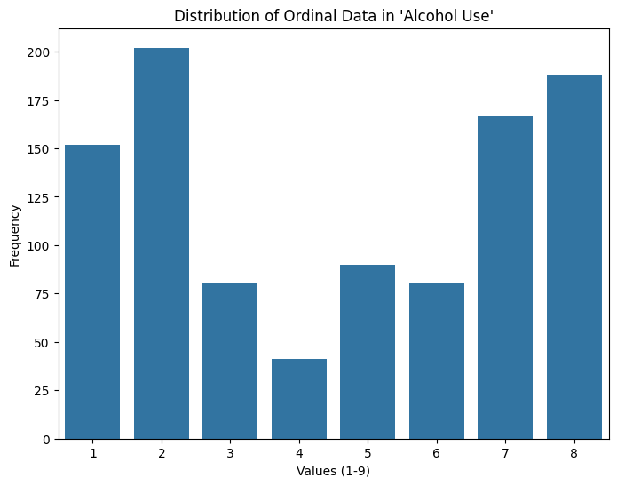
    


    
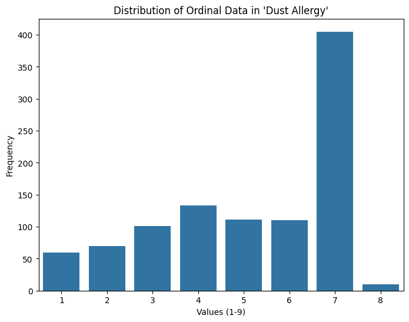
    


    
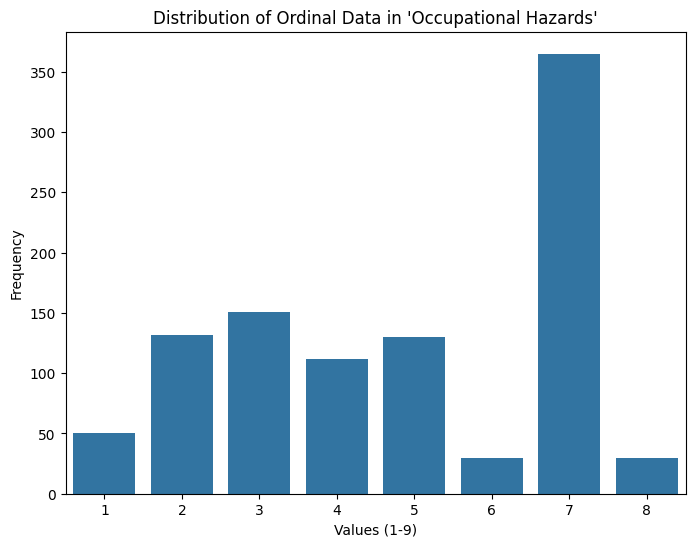
    


    
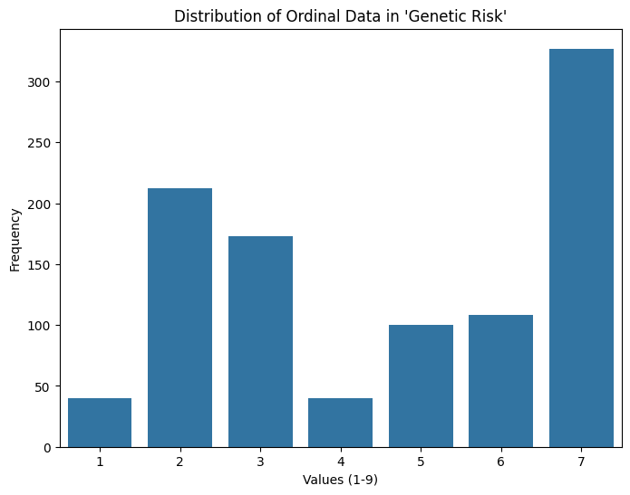
    


    
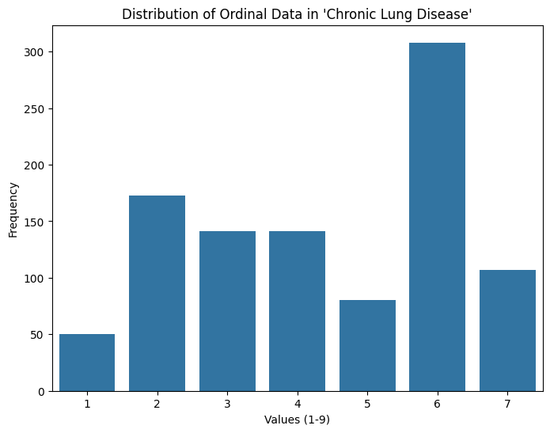
    


    
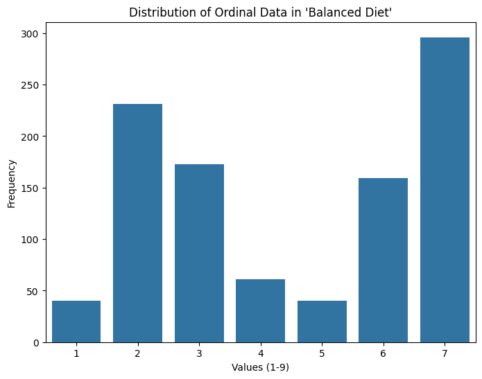
    


    
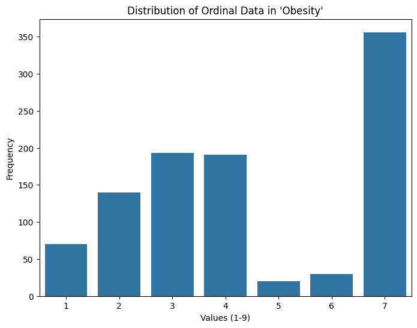
    


    

    


    
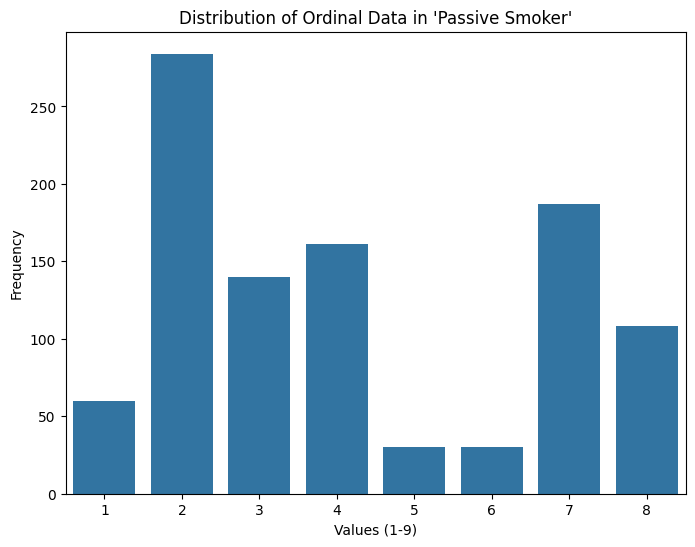
    


    
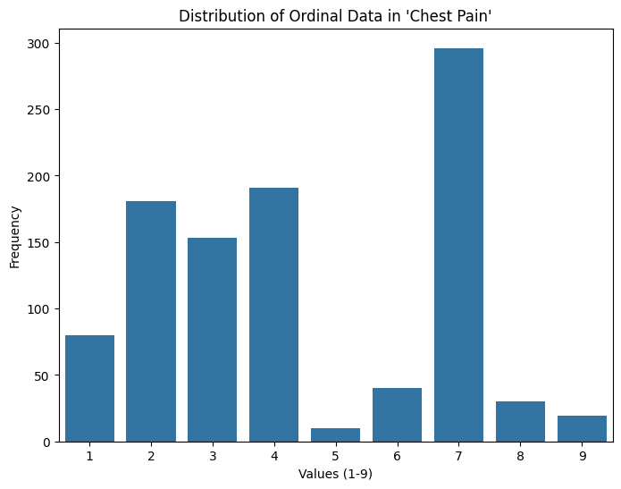
    


    
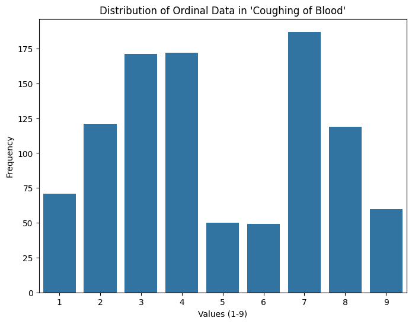
    


    
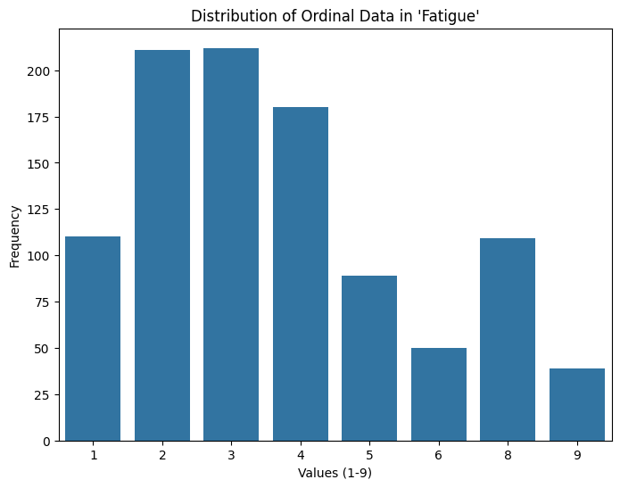
    


    
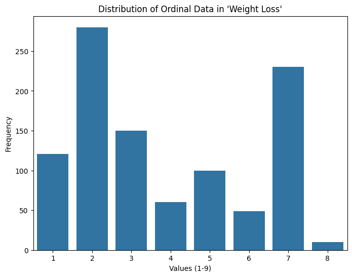
    


    
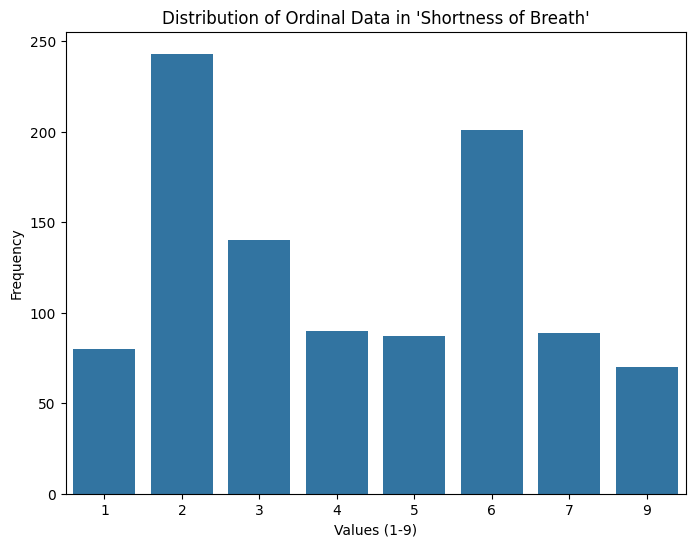
    


    
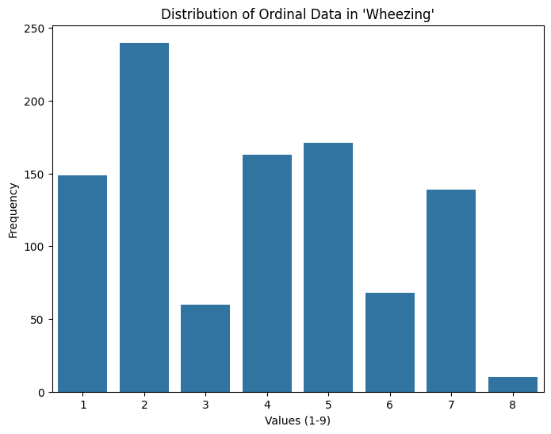
    


    
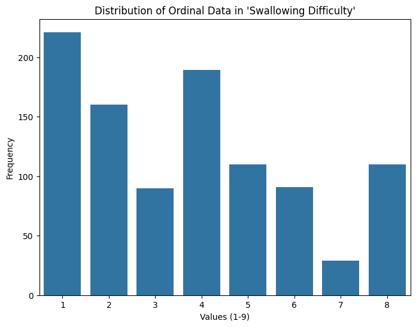
    


    
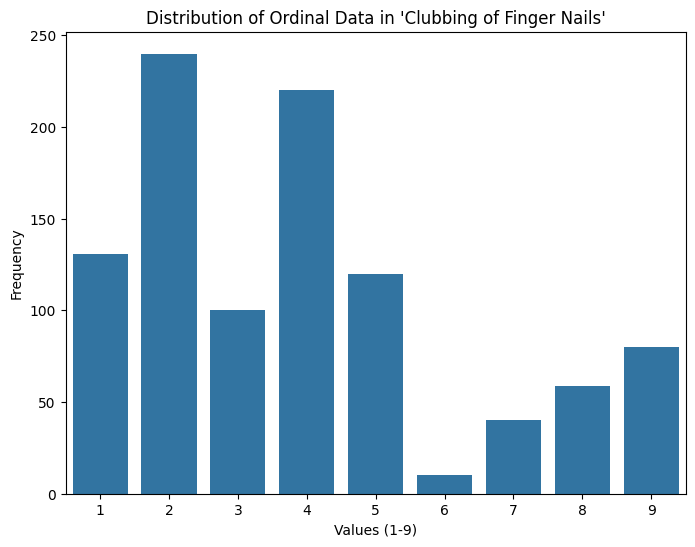
    


    
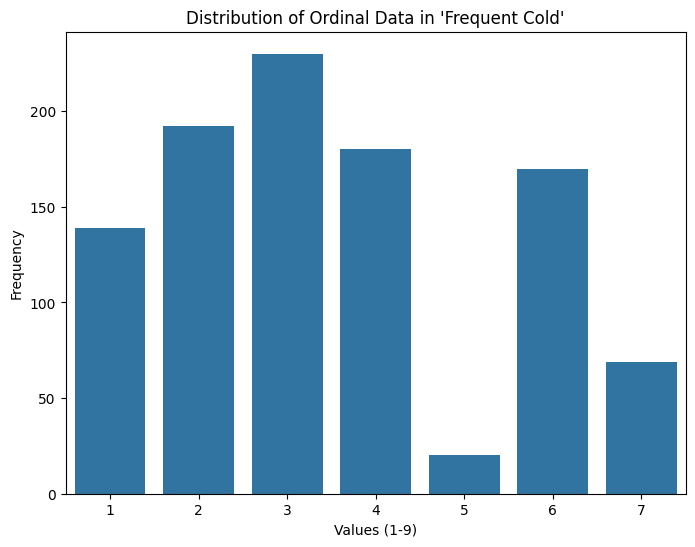
    


    
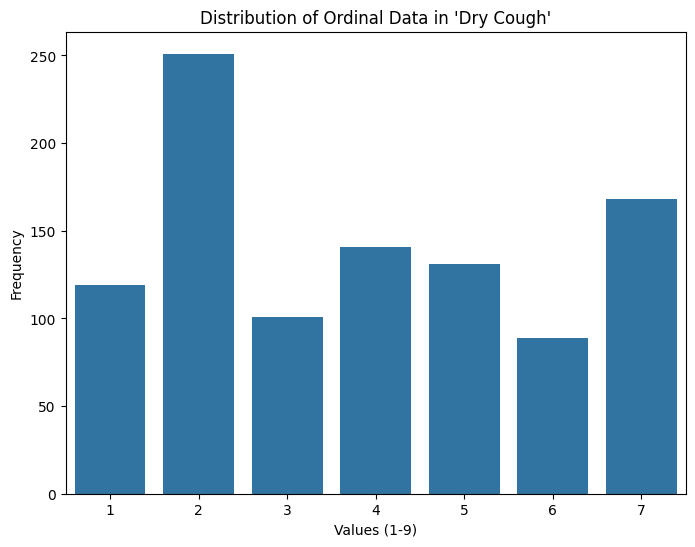
    


    
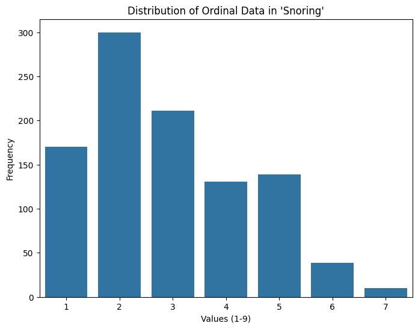
    


### **Test 1: Chi-Squared Test for Independence**
- **Purpose of this test:** To measure the strength and direction of association between two categorical variables.
- **Assumptions:**  The data must consist of two categorical variables. The variables should be measured on a nominal or ordinal scale (but it doesn't test direction like rank correlations do). Each observation should be independent.

**Hypothesis**
- H0: There is no association between the gender of patients and their cancer risk level (i.e. Low, Medium, High).
- Ha: There is an association between the gender of patients and their cancer risk level.


```python
from scipy.stats import chi2_contingency

contingency_table = pd.crosstab(df['Level'], df['Gender'])

chi2, p, dof, expected = chi2_contingency(contingency_table)

print(f"P-value: {p}")
```

    P-value: 1.2251212802771069e-06
    

This is a very small p-value, which is smaller than our alpha value (0.05), so we reject the null hypothesis and conclude that there *is* a correlation.

Let's examine the level counts across genders. Given that we have established a correlation, we would expect the distributions to differ:


```python
import matplotlib.pyplot as plt

fig, axs = plt.subplots(1, 2, figsize=(18, 5))

# seperate into genders and make order explicit
male_levels = contingency_table['male']
female_levels = contingency_table['female']
desired_order = ['Low', 'Medium', 'High']
male_levels = male_levels.reindex(desired_order)
female_levels = female_levels.reindex(desired_order)

# plot male level counts
axs[0].bar(male_levels.index, male_levels.values, color='red')
axs[0].set_title('Male Cancer Risk Levels')
axs[0].set_xlabel('Risk Levels')
axs[0].set_ylabel('Number of Patients')

#plot female level counts
axs[1].bar(female_levels.index, female_levels.values, color='blue')
axs[1].set_title('Female Cancer Risk Levels')
axs[1].set_xlabel('Risk Levels')
axs[1].set_ylabel('Number of Patients')
```


    Text(0, 0.5, 'Number of Patients')


    
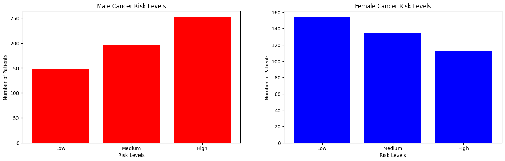
    


### **Test 2: Spearman's Rank-Order Correlation**
- **Purpose of this test:** To measure the strength and direction of association between two ranked variables.
- **Assumptions:** Two variables are ordinal or ranked.

**Hypothesis**
- H0: There is no correlation between balanced diet and weight loss
- Ha: There is correlation between balanced diet and weight loss


```python
from scipy.stats import spearmanr
corr, p_value = spearmanr(df['Balanced Diet'], df['Weight Loss'])

print(f"Spearman correlation coefficient: {corr}, p-value: {p_value}")
```

    Spearman correlation coefficient: -0.021006042857414767, p-value: 0.5070028273987821
    

Since the p-value is greater than 0.05, we cannot conclude that this is statistically significant; therefore, we cannot assert the existence of a correlation between balanced diet and weight loss.

**Hypothesis**
- H0: There is no correlation between smoking and coughing of blood
- Ha: There is correlation between smoking and coughing of blood


```python
corr, p_value = spearmanr(df['Smoking'], df['Coughing of Blood'])

print(f"Spearman correlation coefficient: {corr}, p-value: {p_value}")
```

    Spearman correlation coefficient: 0.5273297490454444, p-value: 1.164427771283622e-72
    

Since the p-value is less than 0.05, we can conclude that  this is a statistically significant relationship and therefore we may assert that there is a positive correlation between smoking and coughing of blood.


```python
variables = df[['Balanced Diet', 'Weight Loss', 'Chest Pain', 'Genetic Risk']]
correlation_matrix = variables.corr(method='spearman')
correlation_matrix
```


  <div id="df-8c5fefae-3ac5-40ba-bbd5-da5e9dd0802b" class="colab-df-container">
    <div>
<style scoped>
    .dataframe tbody tr th:only-of-type {
        vertical-align: middle;
    }

    .dataframe tbody tr th {
        vertical-align: top;
    }

    .dataframe thead th {
        text-align: right;
    }
</style>
<table border="1" class="dataframe">
  <thead>
    <tr style="text-align: right;">
      <th></th>
      <th>Balanced Diet</th>
      <th>Weight Loss</th>
      <th>Chest Pain</th>
      <th>Genetic Risk</th>
    </tr>
  </thead>
  <tbody>
    <tr>
      <th>Balanced Diet</th>
      <td>1.000000</td>
      <td>-0.021006</td>
      <td>0.794299</td>
      <td>0.637459</td>
    </tr>
    <tr>
      <th>Weight Loss</th>
      <td>-0.021006</td>
      <td>1.000000</td>
      <td>0.058736</td>
      <td>0.287858</td>
    </tr>
    <tr>
      <th>Chest Pain</th>
      <td>0.794299</td>
      <td>0.058736</td>
      <td>1.000000</td>
      <td>0.817352</td>
    </tr>
    <tr>
      <th>Genetic Risk</th>
      <td>0.637459</td>
      <td>0.287858</td>
      <td>0.817352</td>
      <td>1.000000</td>
    </tr>
  </tbody>
</table>
</div>


</style>
<table border="1" class="dataframe">
  <thead>
    <tr style="text-align: right;">
      <th></th>
      <th>Smoking</th>
      <th>Coughing of Blood</th>
      <th>Chest Pain</th>
    </tr>
  </thead>
  <tbody>
    <tr>
      <th>Smoking</th>
      <td>1.000000</td>
      <td>0.527330</td>
      <td>0.566226</td>
    </tr>
    <tr>
      <th>Coughing of Blood</th>
      <td>0.527330</td>
      <td>1.000000</td>
      <td>0.673777</td>
    </tr>
    <tr>
      <th>Chest Pain</th>
      <td>0.566226</td>
      <td>0.673777</td>
      <td>1.000000</td>
    </tr>
  </tbody>
</table>


```python
sns.pairplot(variables)
plt.show()
```


    
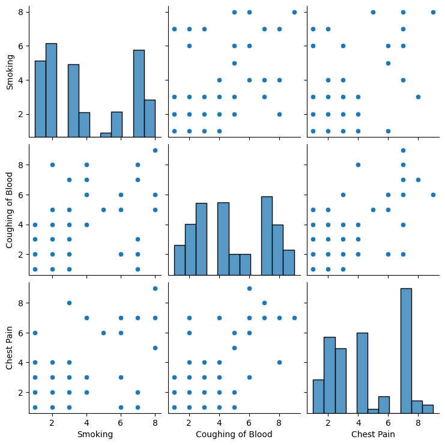
    


### **Test 3: ANOVA**

**Purpose of this test**: To determine if there is a significant difference in age between the three risk groups

**Assumptions**: The age data is continuous and approximately normally distributed

**Hypothesis**

**H0:** There is no significant difference in the mean age of participants between different risk groups.

**Ha**: There is a significant difference in the mean age of participants between different risk groups.


```python
#Split the dataframe by risk level grouping
df_low = df.loc[df['Level'] == 'Low']
df_medium = df.loc[df['Level'] == 'Medium']
df_high = df.loc[df['Level'] == 'High']

#Run a one-way ANOVA
from scipy.stats import f_oneway
f_oneway(df_low["Age"], df_medium["Age"], df_high["Age"])
```


    F_onewayResult(statistic=5.752523603859152, pvalue=0.0032810701129733816)


Since the p-value from the one-way ANOVA result is less than 0.05, we can conclude that there is a significant difference in mean age between the risk groups. We will now conduct post-hoc analysis to determine which groups have a significant difference between one another.


```python
#Run Tukey's Post Hoc Test
!pip install scikit-posthocs
import scikit_posthocs as sp
posthoc = sp.posthoc_tukey(df, val_col='Age', group_col='Level')
posthoc
```

    Collecting scikit-posthocs
      Downloading scikit_posthocs-0.11.0-py3-none-any.whl.metadata (5.8 kB)
    Requirement already satisfied: numpy in /usr/local/lib/python3.10/dist-packages (from scikit-posthocs) (1.26.4)
    Requirement already satisfied: scipy>=1.9.0 in /usr/local/lib/python3.10/dist-packages (from scikit-posthocs) (1.13.1)
    Requirement already satisfied: statsmodels in /usr/local/lib/python3.10/dist-packages (from scikit-posthocs) (0.14.4)
    Requirement already satisfied: pandas>=0.20.0 in /usr/local/lib/python3.10/dist-packages (from scikit-posthocs) (2.2.2)
    Requirement already satisfied: seaborn in /usr/local/lib/python3.10/dist-packages (from scikit-posthocs) (0.13.2)
    Requirement already satisfied: matplotlib in /usr/local/lib/python3.10/dist-packages (from scikit-posthocs) (3.8.0)
    Requirement already satisfied: python-dateutil>=2.8.2 in /usr/local/lib/python3.10/dist-packages (from pandas>=0.20.0->scikit-posthocs) (2.8.2)
    Requirement already satisfied: pytz>=2020.1 in /usr/local/lib/python3.10/dist-packages (from pandas>=0.20.0->scikit-posthocs) (2024.2)
    Requirement already satisfied: tzdata>=2022.7 in /usr/local/lib/python3.10/dist-packages (from pandas>=0.20.0->scikit-posthocs) (2024.2)
    Requirement already satisfied: contourpy>=1.0.1 in /usr/local/lib/python3.10/dist-packages (from matplotlib->scikit-posthocs) (1.3.1)
    Requirement already satisfied: cycler>=0.10 in /usr/local/lib/python3.10/dist-packages (from matplotlib->scikit-posthocs) (0.12.1)
    Requirement already satisfied: fonttools>=4.22.0 in /usr/local/lib/python3.10/dist-packages (from matplotlib->scikit-posthocs) (4.55.0)
    Requirement already satisfied: kiwisolver>=1.0.1 in /usr/local/lib/python3.10/dist-packages (from matplotlib->scikit-posthocs) (1.4.7)
    Requirement already satisfied: packaging>=20.0 in /usr/local/lib/python3.10/dist-packages (from matplotlib->scikit-posthocs) (24.2)
    Requirement already satisfied: pillow>=6.2.0 in /usr/local/lib/python3.10/dist-packages (from matplotlib->scikit-posthocs) (11.0.0)
    Requirement already satisfied: pyparsing>=2.3.1 in /usr/local/lib/python3.10/dist-packages (from matplotlib->scikit-posthocs) (3.2.0)
    Requirement already satisfied: patsy>=0.5.6 in /usr/local/lib/python3.10/dist-packages (from statsmodels->scikit-posthocs) (1.0.1)
    Requirement already satisfied: six>=1.5 in /usr/local/lib/python3.10/dist-packages (from python-dateutil>=2.8.2->pandas>=0.20.0->scikit-posthocs) (1.16.0)
    Downloading scikit_posthocs-0.11.0-py3-none-any.whl (33 kB)
    Installing collected packages: scikit-posthocs
    Successfully installed scikit-posthocs-0.11.0
    


<table border="1" class="dataframe">
  <thead>
    <tr style="text-align: right;">
      <th></th>
      <th>Low</th>
      <th>Medium</th>
      <th>High</th>
    </tr>
  </thead>
  <tbody>
    <tr>
      <th>Low</th>
      <td>1.000000</td>
      <td>0.002178</td>
      <td>0.100005</td>
    </tr>
    <tr>
      <th>Medium</th>
      <td>0.002178</td>
      <td>1.000000</td>
      <td>0.323545</td>
    </tr>
    <tr>
      <th>High</th>
      <td>0.100005</td>
      <td>0.323545</td>
      <td>1.000000</td>
    </tr>
  </tbody>
</table>
</div>
  


Low vs. Medium: P-value = 0.002179

This p-value is less than 0.05, indicating a significant difference between the "Low" and "Medium" groups.

Low vs. High: P-value = 0.100026

This p-value is greater than 0.05, indicating no significant difference between the "Low" and "High" groups.

Medium vs. High: P-value = 0.324074

This p-value is also greater than 0.05, indicating no significant difference between the "Medium" and "High" groups.

These results suggest that the "Low" and "Medium" groups differ significantly, but neither of these groups differs significantly from the "High" group based on this test.

Let's look at a visual representation of this.


```python
# Calculate the mean age for each dataframe
mean_ages = [df_low['Age'].mean(), df_medium['Age'].mean(), df_high['Age'].mean()]
levels = ['Low', 'Medium', 'High']

# Create a bar graph
plt.bar(levels, mean_ages, color=['blue', 'orange', 'green'])

# Add labels and title
plt.xlabel('Level')
plt.ylabel('Mean Age')
plt.title('Mean Age Comparison Across Risk Levels')

# Display the plot
plt.show()
```


    
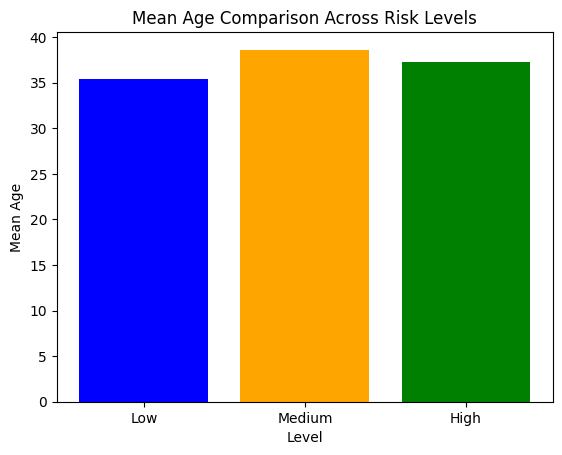
    


```python
plt.figure(figsize=(8, 6))
sns.heatmap(posthoc, annot=True, cmap='coolwarm', cbar=True, square=True)
plt.title("Tukey's Post Hoc Test Result")
plt.show()
```


    
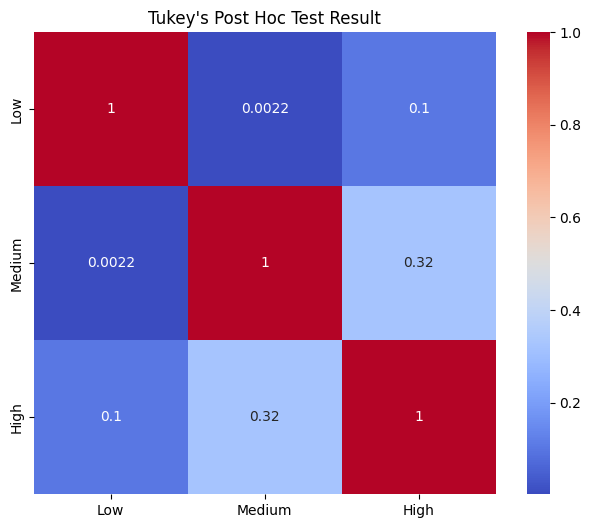
    


### **Machine Learning Analysis**
Our goal is to design a model to predict the risk of cancer based on the features recorded in the dataset. Additionally, we aim to identify which feature contributes the most to lung cancer risk. To achieve this goal, we decided to implement a Random Forest Classifier model as it enables us to easily rank the importance of each feature. Furthermore, the Random Forest model is much more resistant to overfitting than decision trees as we are using an ensemble of decision trees, rather than a single decision tree trained on the entire training dataset.

The general workflow is as follows:<br>
(1) Prepare the Data by ensuring all of our variables are in numerical form (e.g. 'M' --> 1 and 'F' --> 0)<br>
(2) Split the dataset into training and test sets<br>
(3) Fit the model to the training dataset<br>
(4) Evaluate the model on the test dataset<br>

Additionally, we noticed that the evaluation metrics of the model were shockingly high on the test dataset and the cross-validation score increased too rapidly in the plots of our learning curve. We began to suspect that a significant amount of duplicate data was skewing our results, so we removed the duplicate data and then retrained our Random Forest model. After dropping the duplicates, the values of the cross-validation report were much more reasonable.


```python
#import from
from sklearn.model_selection import train_test_split, cross_val_score, StratifiedKFold
from sklearn.preprocessing import StandardScaler
from sklearn.metrics import accuracy_score, classification_report, confusion_matrix, silhouette_score
from sklearn.ensemble import RandomForestClassifier
from sklearn.model_selection import learning_curve
import matplotlib.pyplot as plt

#split data:
X = df.drop(columns=['Level']) #drop target col
y = df['Level'] #target column is stored in the y variable

X['Gender'] = X['Gender'].replace({'male':1, 'female':2}) #convert the only qualitative variable into a quantitative value
test_size = 0.2
X_train, X_test, y_train, y_test = train_test_split(X, y, test_size=test_size, random_state=42) #split the dataset into 80-20


X.head()
```

</style>
<table border="1" class="dataframe">
  <thead>
    <tr style="text-align: right;">
      <th></th>
      <th>Age</th>
      <th>Gender</th>
      <th>Air Pollution</th>
      <th>Alcohol Use</th>
      <th>Dust Allergy</th>
      <th>Occupational Hazards</th>
      <th>Genetic Risk</th>
      <th>Chronic Lung Disease</th>
      <th>Balanced Diet</th>
      <th>Obesity</th>
      <th>...</th>
      <th>Coughing of Blood</th>
      <th>Fatigue</th>
      <th>Weight Loss</th>
      <th>Shortness of Breath</th>
      <th>Wheezing</th>
      <th>Swallowing Difficulty</th>
      <th>Clubbing of Finger Nails</th>
      <th>Frequent Cold</th>
      <th>Dry Cough</th>
      <th>Snoring</th>
    </tr>
  </thead>
  <tbody>
    <tr>
      <th>0</th>
      <td>33</td>
      <td>1</td>
      <td>2</td>
      <td>4</td>
      <td>5</td>
      <td>4</td>
      <td>3</td>
      <td>2</td>
      <td>2</td>
      <td>4</td>
      <td>...</td>
      <td>4</td>
      <td>3</td>
      <td>4</td>
      <td>2</td>
      <td>2</td>
      <td>3</td>
      <td>1</td>
      <td>2</td>
      <td>3</td>
      <td>4</td>
    </tr>
    <tr>
      <th>1</th>
      <td>17</td>
      <td>1</td>
      <td>3</td>
      <td>1</td>
      <td>5</td>
      <td>3</td>
      <td>4</td>
      <td>2</td>
      <td>2</td>
      <td>2</td>
      <td>...</td>
      <td>3</td>
      <td>1</td>
      <td>3</td>
      <td>7</td>
      <td>8</td>
      <td>6</td>
      <td>2</td>
      <td>1</td>
      <td>7</td>
      <td>2</td>
    </tr>
    <tr>
      <th>2</th>
      <td>35</td>
      <td>1</td>
      <td>4</td>
      <td>5</td>
      <td>6</td>
      <td>5</td>
      <td>5</td>
      <td>4</td>
      <td>6</td>
      <td>7</td>
      <td>...</td>
      <td>8</td>
      <td>8</td>
      <td>7</td>
      <td>9</td>
      <td>2</td>
      <td>1</td>
      <td>4</td>
      <td>6</td>
      <td>7</td>
      <td>2</td>
    </tr>
    <tr>
      <th>3</th>
      <td>37</td>
      <td>1</td>
      <td>7</td>
      <td>7</td>
      <td>7</td>
      <td>7</td>
      <td>6</td>
      <td>7</td>
      <td>7</td>
      <td>7</td>
      <td>...</td>
      <td>8</td>
      <td>4</td>
      <td>2</td>
      <td>3</td>
      <td>1</td>
      <td>4</td>
      <td>5</td>
      <td>6</td>
      <td>7</td>
      <td>5</td>
    </tr>
    <tr>
      <th>4</th>
      <td>46</td>
      <td>1</td>
      <td>6</td>
      <td>8</td>
      <td>7</td>
      <td>7</td>
      <td>7</td>
      <td>6</td>
      <td>7</td>
      <td>7</td>
      <td>...</td>
      <td>9</td>
      <td>3</td>
      <td>2</td>
      <td>4</td>
      <td>1</td>
      <td>4</td>
      <td>2</td>
      <td>4</td>
      <td>2</td>
      <td>3</td>
    </tr>
  </tbody>
</table>
<p>5 rows × 23 columns</p>
</div>
   


```python
#train the model and validate
model = RandomForestClassifier(n_estimators = 100, max_depth = 5) #load the initial model with 100 decision tress w/ max depth of 5
model.fit(X_train, y_train)
y_pred = model.predict(X_test)

train_sizes, train_scores, test_scores = learning_curve(model, X_train, y_train, cv=10, scoring='accuracy',  train_sizes=np.linspace(.1, 1.0, 10)) #plot the validation scores

plt.plot(train_sizes, train_scores.mean(axis=1), 'o-', label='Training score')

plt.plot(train_sizes, test_scores.mean(axis=1), 'o-', label='Cross-validation score')

plt.xlabel('Training examples')

plt.ylabel('Score')

plt.title('Learning Curve')

plt.legend()

plt.show()
```


    
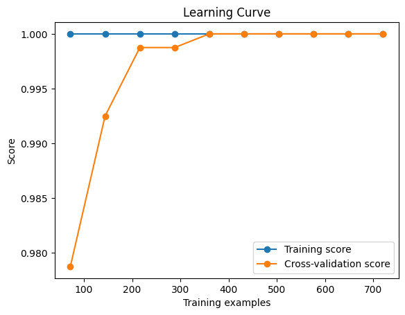
    


```python
accuracy = accuracy_score(y_test, y_pred) #format is y_true, y_test
print(f"Accuracy of Random Forst model: {accuracy:.2f}")
print(classification_report(y_test, y_pred)) # Implement your classification report here
```

    Accuracy of Random Forst model: 1.00
                  precision    recall  f1-score   support
    
            High       1.00      1.00      1.00        82
             Low       1.00      1.00      1.00        55
          Medium       1.00      1.00      1.00        63
    
        accuracy                           1.00       200
       macro avg       1.00      1.00      1.00       200
    weighted avg       1.00      1.00      1.00       200
    
    

The accuracy, precision, and recall scores are way too high! We must have duplicate values in our dataset which could compromise our test dataset.


```python
print(f"Number of duplicate rows: {df.duplicated().sum()}")
df.drop_duplicates(inplace=True) #drop all duplicate data

#split data
X = df.drop(columns=['Level']) #drop target col
X['Gender'] = X['Gender'].replace({'male':1, 'female':2}) #all variables need to be numerical only for RF model
y = df['Level']
X_train, X_test, y_train, y_test = train_test_split(X, y, test_size=0.20, random_state=42) #split dataset

#train data
model = RandomForestClassifier(n_estimators = 100, max_depth = 5) #load and fit the model
model.fit(X_train, y_train)

#test data
y_pred = model.predict(X_test)
```

    Number of duplicate rows: 848
    

   

```python
y_test_pred = model.predict(X_test)
report = classification_report(y_test, y_pred)
print(report)
```

                  precision    recall  f1-score   support
    
            High       1.00      1.00      1.00        15
             Low       1.00      0.67      0.80         6
          Medium       0.83      1.00      0.91        10
    
        accuracy                           0.94        31
       macro avg       0.94      0.89      0.90        31
    weighted avg       0.95      0.94      0.93        31
    
    

These values are much more reasonable! We will now proceed with visualization of the results.

### **Visualization**


```python
from sklearn.metrics import ConfusionMatrixDisplay
cm = confusion_matrix(y_test, y_pred)
disp = ConfusionMatrixDisplay(confusion_matrix=cm, display_labels=['Low', 'Medium', 'High'])
disp.plot(cmap="Blues")
```


    <sklearn.metrics._plot.confusion_matrix.ConfusionMatrixDisplay at 0x7f8ae4ab9630>


    
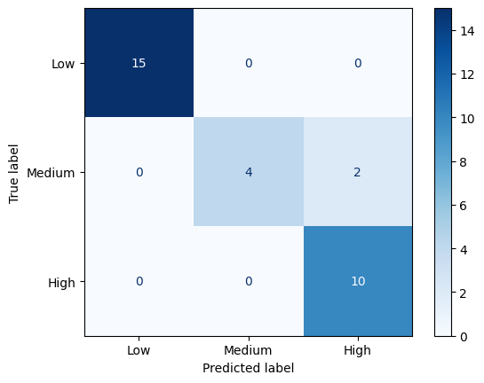
    


**Confusion Matrix**: The confusion matrix visualizes the performance of the Random Forest model. It shows the counts of true positives, true negatives, false positives, and false negatives for each risk level (i.e. Low, Medium, High). This matrix provides an overview of where the model is making correct and incorrect predictions, which was valuable because the accuracy alone was not a clear metric of how well our model was working. Unfortunately, there was not a lot of data to examine. Nonetheless, our model performed well. A majority of the shaded areas represent true positives!


```python
#feature importance
important_features = pd.Series(model.feature_importances_, index=X_train.columns).sort_values()
important_features.plot(kind='barh')
plt.yticks(range(len(important_features)), important_features.index)
plt.xlabel("Feature Importance")
plt.show()
```


    
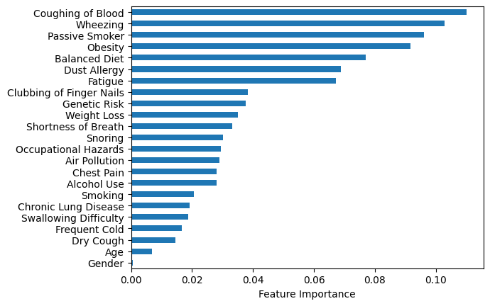
    


**Feature Importance:** The bar plot of feature importances reveals which features are most influential in the model's predictions. Above, the plot indicates that "Coughing of Blood" and "Wheezing" are the most important features. Other factors were also important, but to a lesser extent. This information is valuable for understanding which variables play a critical role in determining lung cancer risk and which are likely less relevant. That insight could help medical professionals in making better diagnoses for this disease.

### **Insights and Conclusions**

There is a worryingly high rate of duplication in this dataset, which may skew the analysis. There are $9^{21}*2$ theoretical combinations of the various feature values, excluding age. Unfortunately, with only a sample of 1000 entries, there are only 8 to 9 unique combinations with some combinations having up to 50 duplicates. When factoring age into the calculation, it doesn't fare too much better, because there are 100 times more theoretical combinations, and less than twice the number of unique samples (to 152). The highest number of duplicates drops only to 19.

However, since the unique data was a sufficently large sample, we can draw the following conclusions:

1. Men face a higher risk of developing cancer with the same risk factors compared to women.
* The p-value from this analysis and the following distributions lend to a significant factor that could greatly reduce or increase the risk of cancer based on something seemingly innate to the difference between men and women. If further investigation shows that this association can be tracked more concretely to the levels of certain hormones, then there could be fantastic results from that research.
2. Based on the data given for both “Balanced Diet” (details unspecified) and “Weight Loss” (details unspecified), there is no statistically significant connection between the two.
3. A statistically significant correlation exists between “Smoking” and “Coughing of Blood.”
4. The evaluation of average age between “Low” and “Medium” risk groups shows a significant difference. However, no signifigant difference is observed between either of these groups and the “High” risk group.
* The potential underlying processes that might cause such a distinction (at least) at face value seems to arbitrary to limit solely to age, and further investigation would be needed to begin any conclusions from this.


The final analysis of our model highlighted the issues with the original dataset.

At this stage, the duplication in our data became overwhelmingly prominent, with the training data (comprising 80% of the data) nearly perfectly overlapping with the testing data (the remaining 20%), effectively obscuring any overtraining.

Additionally, the dataset mixed what are seemingly *symptoms* (e.g. "Coughing of Blood") with what are seemingly *causes* (e.g. "Passive Smoking").

After seperating the two, the highest symptom indicators are "Coughing of Blood" and "Wheezing," each with around a 10% indicator of severity. The leading causes, on the other hand, were "Passive Smoking" and "Obesity," both at around 9%.
